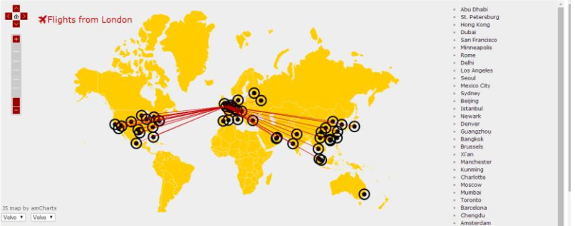
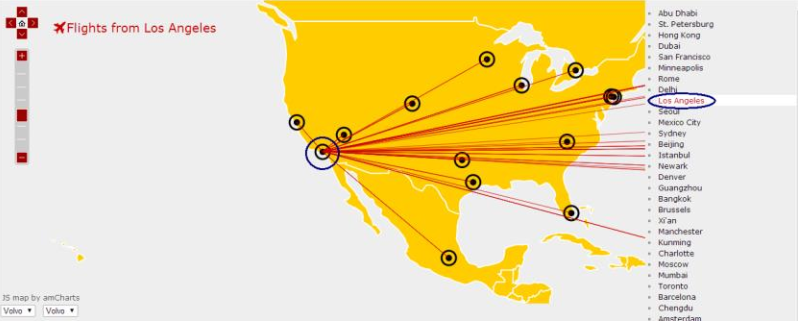
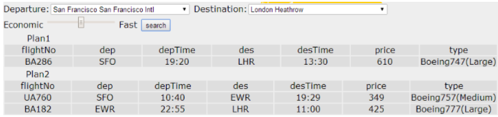

Python-Flight-Map
=================
This is a course project for INFO 155. 

The main function of the visualization program is to show flights related to particular airports and to manage the routes between two cities. Since the airports all over the world is too much to be showed clearly on a map, the 50 airports with the most flights are chosen to be showed in the program. Some properties of these airports are visualized including:

1. By clicking the point on the map or the name of the city, users can see all flights related.
2. Different styles and colors of lines represent the type of plane and elapsed flight time.

Also, the project has applications that help manage the route by stopping over. It will take both time (including time of waiting) and price. If prices are hard to get, it will be replaced by time of flying, which is supposed to be positive related to the price.

##User Interface

All points are showed on the world map. Each point represents an airport.

The departure airport can be chosen by clicking the airport directly or find it in the list on the right. Then the map will show all the flights start from the airport. The departure airport will be automatically moved to the center of the map.

At the bottom of the screen, there are two combo boxes to choose the place of departure and destination. Users can choose them to let the system manage the route, whose price and time will appear on the chart below. Move the slide block on the bar to show if the user pays more attention to prices or efficiency, then press “search”. The system will provide different results according to users’ preference.

##Information Source

The information of all airlines in the world is published on the website www.openflights.org. 
For the real-time data such as time and price, they can be found on the website www.qunar.com. 

##Install

- Clone the project using this url: https://github.com/zhangwengame/Python-Flight-Map.git
- Install python3.4
- Using pip install BeautifulSoup4
- Install wamp from this url: http://www.wampserver.com/en/
- Put the “Demo” folder in our project to wamp/www/
- We have already generated the airports and flights that will be displayed on the website. If you want to choose them yourself, download latest airlines.dat, airports.dat and routes.dat from http://openflights.org/data.html. Run FindAirport.py to generate new nairport and nroute, then use PrintData.py to convert those information into data.js. Then put data.js to Demo\ammap\
- Use createData.py to get latest flight information from http://www.qunar.com/. The information will be stored in Demo\flight\flightData\. This process may take half an hour to an hour.
- Run wamp. Open a browser and enter http://127.0.0.1/demo/flight/flightroutes.html, then you can use the user interface the interact with our program
